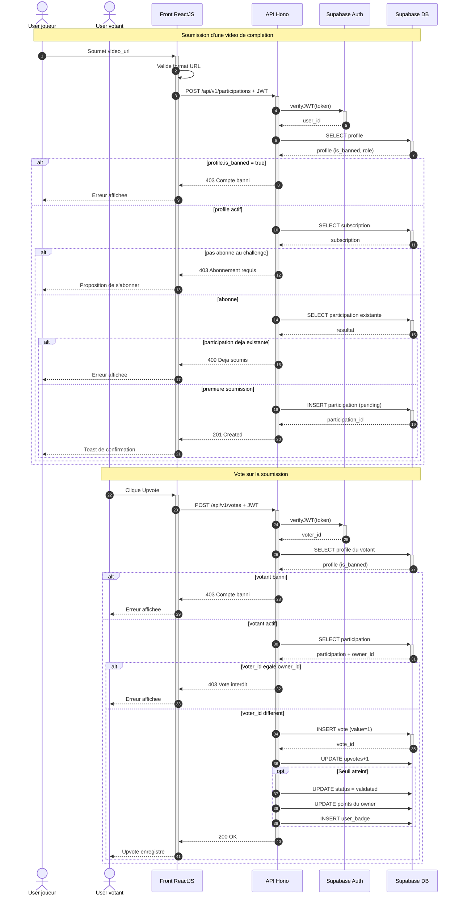

```mermaid
sequenceDiagram
    autonumber
    actor U as User joueur
    actor V as User votant
    participant F as Front ReactJS
    participant API as API Hono
    participant SA as Supabase Auth
    participant DB as Supabase DB

    Note over U,DB: Soumission d'une video de completion

    U->>+F: Soumet video_url
    F->>F: Valide format URL
    F->>+API: POST /api/v1/participations + JWT
    API->>+SA: verifyJWT(token)
    SA-->>-API: user_id

    API->>+DB: SELECT profile
    DB-->>-API: profile (is_banned, role)

    alt profile.is_banned = true
        API-->>F: 403 Compte banni
        F-->>U: Erreur affichee
    else profile actif
        API->>+DB: SELECT subscription
        DB-->>-API: subscription

        alt pas abonne au challenge
            API-->>F: 403 Abonnement requis
            F-->>U: Proposition de s'abonner
        else abonne
            API->>+DB: SELECT participation existante
            DB-->>-API: resultat

            alt participation deja existante
                API-->>F: 409 Deja soumis
                F-->>U: Erreur affichee
            else premiere soumission
                API->>+DB: INSERT participation (pending)
                DB-->>-API: participation_id
                API-->>-F: 201 Created
                F-->>-U: Toast de confirmation
            end
        end
    end

    Note over V,DB: Vote sur la soumission

    V->>+F: Clique Upvote
    F->>+API: POST /api/v1/votes + JWT
    API->>+SA: verifyJWT(token)
    SA-->>-API: voter_id

    API->>+DB: SELECT profile du votant
    DB-->>-API: profile (is_banned)

    alt votant banni
        API-->>F: 403 Compte banni
        F-->>V: Erreur affichee
    else votant actif
        API->>+DB: SELECT participation
        DB-->>-API: participation + owner_id

        alt voter_id egale owner_id
            API-->>F: 403 Vote interdit
            F-->>V: Erreur affichee
        else voter_id different
            API->>+DB: INSERT vote (value=1)
            DB-->>-API: vote_id
            API->>DB: UPDATE upvotes+1

            opt Seuil atteint
                API->>DB: UPDATE status = validated
                API->>DB: UPDATE points du owner
                API->>DB: INSERT user_badge
            end

            API-->>-F: 200 OK
            F-->>-V: Upvote enregistre
        end
    end
```